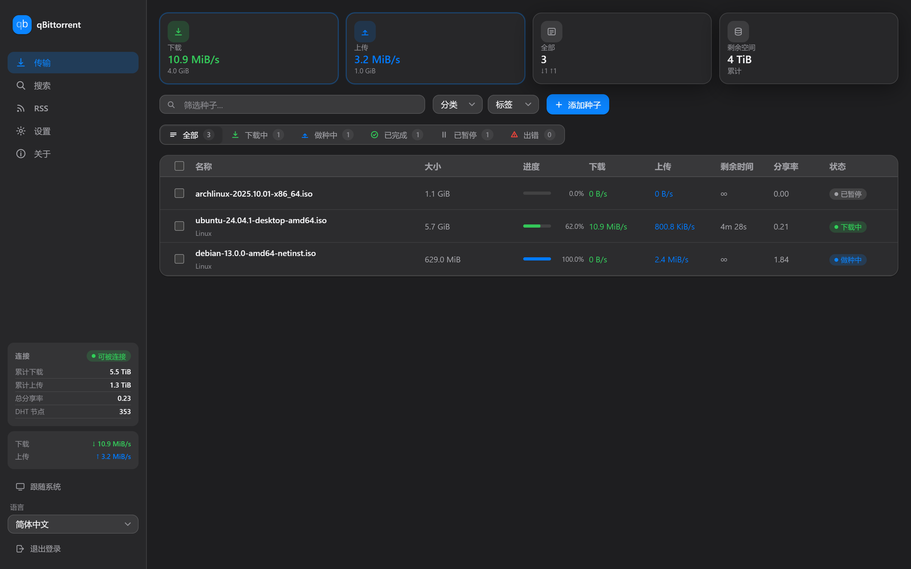
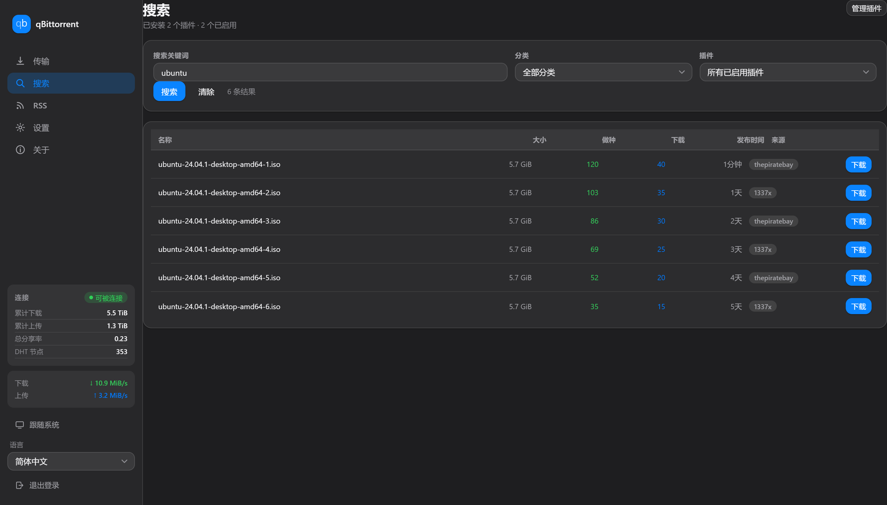
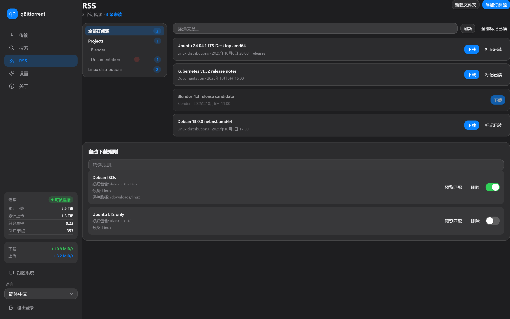
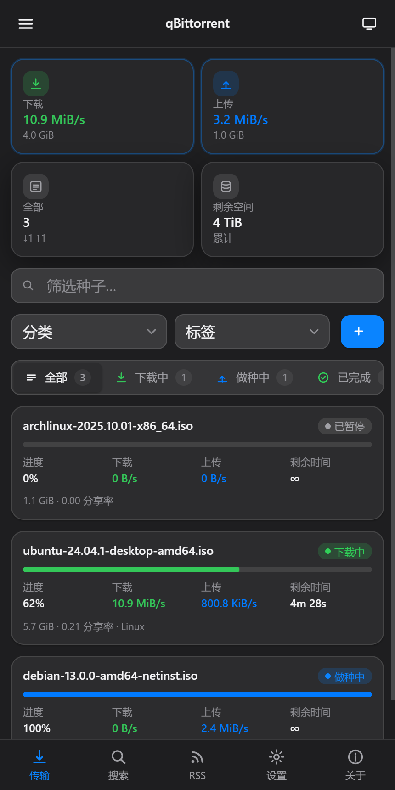

# MacUI — a macOS-style WebUI for qBittorrent

**English** · [简体中文](README.zh-CN.md)

> ### ⚠️ This project is 100% AI-built
>
> Every line of code, documentation and configuration in this repository was
> written by an AI coding agent, directed by a maintainer **who does not write
> code**. Please read that as a statement about what you are getting:
>
> - **It is used daily in production** by its maintainer, and it is developed
>   against real qBittorrent releases rather than in the abstract.
> - **It has not been reviewed by a human programmer.** There may be mistakes a
>   human reviewer would have caught.
> - **It ships without warranty** (MIT — see [Licence](#licence)).
>
> Bug reports, corrections and pull requests are genuinely welcome. If you find
> something wrong, you are not being a nuisance — you are the reviewer this
> project never had.

A complete alternative WebUI for qBittorrent with a macOS visual language:
frosted glass, rounded corners, real depth, and a layout that adapts properly
from a phone to a desktop rather than just shrinking.

It is **not a CSS skin**. qBittorrent's "alternative WebUI" mechanism serves an
entirely separate front-end, so the interface could be rebuilt from scratch
instead of fought with `!important`.

| Dashboard | Search | RSS |
| --- | --- | --- |
|  |  |  |

<p align="center">
  
  
</p>

---

## Contents

- [Features](#features)
- [Requirements](#requirements)
- [Install](#install)
- [Configuration](#configuration)
- [Updating](#updating)
- [Uninstalling](#uninstalling)
- [Troubleshooting](#troubleshooting)
- [Development](#development)
- [Architecture](#architecture)
- [Project structure](#project-structure)
- [Contributing](#contributing)
- [Licence](#licence)

---

## Features

### Interface

- **macOS visual language** — frosted-glass panels via `backdrop-filter`,
  continuous rounded corners, layered shadows, and a proper dark/light pair.
- **Auto-adaptive layout** — three breakpoints (`<600px`, `600–1023px`,
  `≥1024px`). Desktop gets a sidebar, tablet a collapsed icon rail, mobile a
  bottom tab bar and card-based lists. Not a scaled-down desktop UI.
- **Bilingual** — English and Simplified Chinese, switchable at runtime.
- **Installable as an app** — a web app manifest and service worker make it
  behave like a native app on desktop and mobile.

### Torrent management

- Live list with sorting, filtering and multi-select, driven by
  `sync/maindata` incremental updates.
- Per-torrent detail view: overview, files with per-file priority, peers,
  trackers.
- Add torrents by magnet link, `.torrent` URL or file upload.
- Pause, resume, recheck, reannounce, rename, categorise, tag, set location,
  queue position, sequential download, first/last piece priority.
- Delete with or without downloaded data, behind a confirmation prompt.

### RSS

- Full feed tree, including arbitrarily nested folders.
- Unread counts aggregated per folder, with a badge on feeds whose last fetch
  failed.
- Article list with one-click download and mark-as-read.
- Auto-download rules with an enable toggle and a preview of matching articles.

### Search

- Plugin-based search across all enabled plugins, with per-plugin category
  selection.
- Sortable results table with size, seeds, peers, age and one-click download.
- Plugin management: install from URL, enable/disable, check for updates.

### Settings

- **150 preferences across 8 groups**, driving the same API the stock WebUI
  uses.
- All optional settings are preserved through a **lossless round-trip** — see
  [Architecture](#architecture).
- A dedicated credentials panel for changing the WebUI username and password.

### Correctness details worth calling out

- **Every setting is validated for reversibility.** A value that would not
  survive a save/reload cycle is treated as a bug, not as cosmetics.
- **Server-reported units are taken at face value.** The refresh interval is
  milliseconds; treating it as seconds freezes live updates for 25 minutes.
  See [Architecture](#architecture).

---

## Requirements

### To run it

- **qBittorrent 4.5 or newer.** Developed and tested against 5.2.2.
  Older releases are explicitly not supported.
- **Any modern browser.** Safari 16+, Firefox 103+, Chrome 76+ and Edge 79+ are
  the floor set by `backdrop-filter`.

### To build it

- **Node.js ≥ 20.19** — required by Vite 6.
- **pnpm ≥ 9** — `npm` and `yarn` are not supported; the install hook and
  lockfile assume pnpm.

You do **not** need Node.js to *deploy*: prebuilt static files are published on
the `dist` branch. See [Install](#install).

---

## Install

There are two routes. Pick one.

### Option A — prebuilt (no Node.js needed)

Recommended for most people, and the only option if your qBittorrent host has no
JavaScript toolchain.

**1. Fetch the prebuilt files onto the machine running qBittorrent.**

```bash
git clone --branch dist --single-branch \
  https://github.com/OWNER/macui-qbittorrent.git macui-qbittorrent
```

`dist` is an orphan branch rebuilt on every release, so **never `git pull` it** —
always reset (see [Updating](#updating)).

**2. Note the absolute path to that folder.**

The folder you point qBittorrent at must be the one **containing** `public/` and
`private/` — not one of those directories itself.

```
macui-qbittorrent/
├── private/     <- the actual UI
├── public/      <- the signed-out entry page
└── README.md
```

**3. Tell qBittorrent to use it.**

Do not edit `qBittorrent.conf` by hand. Use the WebUI:

1. Open qBittorrent's own WebUI and go to **Options → WebUI**.
2. Tick **Use alternative WebUI**.
3. Set **Files location** to the path from step 2.
4. Save, then reload the page.

If you are running qBittorrent in Docker, the path in step 3 is the path
**inside the container**, so the folder must be mounted. See
[Configuration](#configuration).

### Option B — build from source

**1. Install the toolchain.**

```bash
# Node 20.19+ is required.
node --version

# Enable pnpm through corepack (ships with Node, no root needed).
corepack enable
corepack prepare pnpm@latest --activate
```

If corepack is unavailable, use the official installer instead:

```bash
curl -fsSL https://get.pnpm.io/install.sh | sh -
exec $SHELL -l
```

On Debian/Ubuntu you may need `build-essential` for the native modules.

**2. Build.**

```bash
git clone https://github.com/OWNER/macui-qbittorrent.git
cd macui-qbittorrent
pnpm install
pnpm build
```

`pnpm install` also installs a git hook (see [Development](#development)).

**3. Deploy `dist/`.**

The build writes `dist/public/` and `dist/private/` in exactly the layout
qBittorrent expects. Copy `dist/` anywhere the qBittorrent process can read it
and point **Files location** at the folder containing `public/` and `private/`.

---

## Configuration

### Docker (LinuxServer.io image)

The LinuxServer image is what this project is developed against. The only thing
that matters is that the folder is visible to the container at a predictable
path.

```yaml
services:
  qbittorrent:
    image: lscr.io/linuxserver/qbittorrent:latest
    container_name: qbittorrent
    environment:
      - PUID=1000
      - PGID=1000
      - TZ=Etc/UTC
      - WEBUI_PORT=8080
    volumes:
      - /path/to/config:/config
      - /path/to/downloads:/downloads
      # Mount the theme next to the config so it survives container rebuilds.
      - /path/to/macui-qbittorrent:/config/macui-qbittorrent
    ports:
      - 8080:8080
      - 6881:6881
      - 6881:6881/udp
    restart: unless-stopped
```

Then set **Files location** to the **container** path:

```
/config/macui-qbittorrent
```

And keep it in the config file so the setting is reproducible:

```ini
[Preferences]
WebUI\AlternativeUIEnabled=true
WebUI\RootFolder=/config/macui-qbittorrent
```

> **No container restart is needed after switching.** qBittorrent re-reads this
> preference when it changes, so the new UI appears on the next page load. A
> restart *is* needed after replacing the files on disk if your browser has
> cached the old bundle — a hard reload (`Ctrl+Shift+R`) is usually enough.

### Reverse proxy

The theme is plain static files, so any proxy works. Two notes:

- **Serve it under a sub-path carefully.** Asset URLs are relative, so
  `https://host/qbt/` works, but the proxy must forward the path unchanged.
- **`backdrop-filter` needs no special headers**, but if you strip CSP, keep
  `style-src 'unsafe-inline'` — Vue injects component styles at runtime.

---

## Updating

### Prebuilt (`dist` branch)

The `dist` branch is an **orphan branch rebuilt from scratch** on every release.
Its history is deliberately not related to the previous release, so `git pull`
reports divergent branches and fails. Always reset:

```bash
cd /path/to/macui-qbittorrent
git fetch origin dist
git reset --hard origin/dist
```

Then hard-reload the page. Restart the container only if your setup caches files
in a way a reload cannot clear.

### From source

```bash
cd macui-qbittorrent
git pull
pnpm install
pnpm build
# copy dist/ over your deployed folder
```

**Always hard-reload after updating.** The app registers a service worker, so
your browser may keep serving the previous build. On mobile you may need to clear
the site data.

---

## Uninstalling

1. In qBittorrent, go to **Options → WebUI** and untick **Use alternative
   WebUI**.
2. Save and reload. The stock WebUI returns immediately.
3. Delete the theme folder if you no longer want it.

**You do not need to restart the container**, and your settings, torrents and
session are untouched — this theme only replaces the front-end files.

> If you cannot reach the WebUI to untick the box (for example the theme files
> are broken), edit `qBittorrent.conf` and set
> `WebUI\AlternativeUIEnabled=false`, then restart the container.

---

## Troubleshooting

### The page is blank, or I get a 404

Almost always a wrong **Files location**. It must be the folder that *contains*
`public/` and `private/`. Pointing at `private/` itself, or at the parent of the
theme folder, produces exactly this.

Confirm the layout on the machine running qBittorrent:

```bash
ls /path/to/macui-qbittorrent
# must list: public  private
```

### I am stuck on the sign-in page and cannot get back to the stock WebUI

The theme replaces `private/index.html` only. The stock WebUI is still there:
untick **Use alternative WebUI** in Options → WebUI, or set
`WebUI\AlternativeUIEnabled=false` in `qBittorrent.conf` and restart.

### "Invalid username or password" even though the password is right

Try a hard reload (`Ctrl+Shift+R`) first. If that fixes it, your browser was
serving a stale cached bundle.

If it persists, you are probably hitting a genuinely different problem: check
whether your qBittorrent has **IP banning** enabled and whether your address is
temporarily banned after failed attempts. A temporary ban returns HTTP 403 rather
than a credentials error, and the theme reports that case explicitly.

### Changes to the theme do not show up

The service worker is serving the old build. Hard-reload, or clear the site data
on mobile. This is the single most common "it did not work" report and it is
almost never a bug in the theme.

### Search returns nothing

Two distinct causes, and the theme tells them apart:

- **No plugins installed.** qBittorrent ships with *zero* search plugins. Open
  **Search → Manage plugins** and install some from the
  [official plugin list](https://github.com/qbittorrent/search-plugins/wiki/Unofficial-search-plugins).
- **Python is not available.** The search engine runs plugins through Python. If
  it is missing, `search/start` returns HTTP 409 and the theme explains this. On
  the LinuxServer image, install Python in the container and restart.

### The cumulative totals show zero

Fixed in 0.2.0. If you still see zeroes, you are running an older build —
update.

### Backdrop blur looks wrong or is missing

`backdrop-filter` requires a reasonably modern browser and, on some Linux
setups, a compositor. Firefox before 103 and Safari before 16 will render flat
panels.

---

## Development

```bash
pnpm install     # install deps and activate the git hook
pnpm dev         # dev server on http://localhost:5173
pnpm build       # typecheck, build, and reshape into dist/public + dist/private
pnpm test        # unit tests
pnpm lint        # ESLint
pnpm typecheck   # vue-tsc only
```

### Available scripts

| Command | What it does |
| --- | --- |
| `pnpm dev` | Vite dev server with HMR. |
| `pnpm build` | Typecheck → build → reshape output → validate layout. |
| `pnpm test` | Vitest unit suite. |
| `pnpm lint` / `pnpm lint:fix` | ESLint. |
| `pnpm format` | Prettier. |
| `pnpm verify:dist` | Replays qBittorrent's path resolution against a built tree. |
| `pnpm verify:entry` | Drives the signed-out entry page in jsdom. |
| `pnpm verify:settings` | Asserts the settings layout did not regress. |
| `pnpm publish:dist` | Rebuilds and pushes the `dist` branch. |

### Pointing the dev server at qBittorrent

Vite proxies `/api` so you can develop against a real instance:

```ts
// vite.config.ts
server: {
  proxy: {
    '/api': {
      target: 'http://YOUR_QBITTORRENT:8080',
      changeOrigin: true,
    },
  },
},
```

Start qBittorrent with `--webui-port=8080` (or use the Docker port mapping), run
`pnpm dev`, and sign in through the proxied API. CORS is not an issue because the
browser only ever talks to the dev server.

### The git hook

`pnpm install` runs `scripts/install-hooks.mjs`, which points
`core.hooksPath` at `hooks/`. On `main`, a commit that changes build inputs
rebuilds the `dist` branch locally so the prebuilt files never lag behind the
source. It never blocks a commit and never pushes. Skip it for one commit with:

```bash
SKIP_DIST_SYNC=1 git commit ...
```

---

## Architecture

### Why an alternative WebUI

qBittorrent's **alternative WebUI** mechanism serves a whole separate front-end.
That means the markup could be designed rather than overridden, which is the
difference between a theme that looks intentional and one held together by
`!important`. The trade-off is that this only works with the classic WebUI
enabled, since it *is* that UI, replaced.

### The directory layout contract

This is the part that trips people up, so it is worth stating precisely. From
qBittorrent's `webapplication.cpp`, a request resolves to:

```
<root>/<session ? "private" : "public">/<requested path>
```

Three consequences:

1. **The entry document lives at `private/index.html`.** A signed-in user
   requesting `/` is served `private/index.html`.
2. **`public/` must exist** and holds the signed-out page. A visitor with no
   session can only ever be served from `public/`, so the sign-in form has to
   live there — it cannot be a redirect into `private/`.
3. **`private/index.html` must not be reachable as `/private/index.html`.**
   The server prepends `private/` itself, so that path resolves to
   `private/private/index.html`, which does not exist.

Other constraints the build enforces: no symlinks, no file over 10 MiB, and
relative asset URLs only.

`pnpm verify:dist` replays this resolution against a built tree and fails the
build if any of it is wrong.

### Data flow

```
sync/maindata (incremental, rid cursor)
        │
        ▼
  session store (Pinia)
        │
        ├── torrents Map, categories, tags
        └── server_state, transfer/info
```

Polling uses qBittorrent's `rid` cursor: the first request sends `rid=0` and
receives a full snapshot, and every later request sends the previous `rid` and
receives only a delta. The store merges those deltas, which is why
`torrents_removed` / `categories_removed` / `tags_removed` are handled
explicitly — a delta never mentions what it did not change.

**The cursor is always reset to 0 on `start()`.** Reusing a cursor after a
stop/start cycle means the server answers with a delta, and a delta will not
report torrents that were removed while the client was away, leaving stale rows
in the list.

### Polling uses the server's own interval, in milliseconds

`server_state.refresh_interval` is **milliseconds** (default 1500). The server
sets it from `session->refreshInterval()` and the official WebUI passes it
straight to `setTimeout`. Treating it as seconds makes the poll interval 25
minutes, so the first snapshot paints and the UI then silently stops updating.

### The cumulative totals are in either payload

`server_state` is `getTransferInfo()` plus a few additions, so the cumulative
totals are available from **both** `sync/maindata` and `transfer/info`. The
store's `stat()` checks `server_state` first and falls back to `transfer`, which
is safe for either layout.

(An earlier version of this project claimed the totals were exclusive to one
endpoint. That was wrong, and the real cause of the zeroes it was blamed for was
the interval-units bug above. It is documented here because the wrong explanation
is a tempting one to reach for.)

### Pause/Resume are `stop`/`start` on the wire

`torrents/pause` and `torrents/resume` were removed in qBittorrent 5.0 and
replaced by `torrents/stop` and `torrents/start`, with no alias. The API resolves
`<action>Action` by name and returns 404 for anything else. The UI still says
"pause"/"resume" because that is what the states are called to a user.

The same rename applies to adding a torrent: 5.x reads `stopped`, not `paused`.

### Lossless settings round-trip

The settings view is generated from a schema of 150 fields. Two rules keep it
safe:

1. **Values must be byte-for-byte reversible.** Every field is validated by
   round-tripping `fromApi(toApi(v)) === v`. This caught a real bug where a
   `bytesPerSec` field divided by 1024 for display and multiplied back on save,
   silently turning `10` into `0` — non-reversible for 99.9% of inputs.
2. **Unknown keys are preserved.** The settings form submits only what it knows
   about, but it never drops preferences it does not understand, so opening the
   settings page cannot downgrade your configuration.

`pnpm verify:settings` guards the layout against regression.

### Responsive strategy

Three breakpoints, `<600px`, `600–1023px` and `≥1024px`, resolved in exactly one
place (`useBreakpoint`). Components read the result rather than each testing
media queries independently, which is what keeps desktop, tablet and mobile from
drifting apart.

---

## Project structure

```
├── index.html                  # Vite entry, becomes private/index.html
├── static-public/              # signed-out page, becomes public/index.html
├── public/                     # icons, manifest source
├── src/
│   ├── api/                    # one module per qBittorrent API area
│   ├── components/             # base/ primitives, torrent/ domain components
│   ├── composables/            # useBreakpoint, useToast, useTheme, useTorrentFilter
│   ├── config/                 # settings schema, section layout, writable keys
│   ├── i18n/                   # en and zh-CN locales
│   ├── layouts/                # AppLayout: sidebar, rail, bottom tabs
│   ├── router/                 # hash history, auth guard
│   ├── stores/                 # session store (sync, polling, derived state)
│   ├── types/                  # API types
│   ├── utils/                  # formatting helpers
│   ├── views/                  # Dashboard, TorrentDetail, Search, Rss, Settings…
│   └── __tests__/              # Vitest suites
├── scripts/                    # build, verification and tooling scripts
├── hooks/                      # tracked git hooks (activated via core.hooksPath)
└── deploy/                     # deployment notes shipped with the dist branch
```

### Design tokens

All colour, spacing, radius and shadow values are CSS custom properties defined
in one place. Light and dark themes swap the token values; no component knows
which theme is active. This is what makes the frosted-glass surfaces work in both
without per-component overrides.

---

## Contributing

Contributions are welcome, especially **corrections**. Because this project is
AI-built, a human reviewing the logic is the most valuable thing you can
contribute.

### Before opening a pull request

```bash
pnpm lint
pnpm typecheck
pnpm test
pnpm build
pnpm verify:dist
```

All five must pass.

### Testing philosophy

When fixing a bug, add a test that **fails without the fix**. Then verify the
test is not vacuous by re-introducing the bug and confirming the test fails.
Several guards in this repo were silently useless until that check was applied —
including one that asserted a schedule count without ever creating the race that
would break it.

### Reporting a bug

Include:

- qBittorrent version and how you run it (Docker image, native, …)
- Browser and version
- What you expected, what happened, and the exact steps
- Browser console output

### Scope

Out of scope by design: support for qBittorrent older than 4.5, and any feature
that requires patching qBittorrent itself.

---

## Licence

[MIT](LICENSE).

qBittorrent is licensed separately under GPL-2.0-or-later. This project is an
independent front-end that talks to its WebAPI over HTTP; it contains no
qBittorrent source code. The brand mark in the sidebar reproduces the official
qBittorrent icon geometry so the theme is recognisable, and that artwork remains
the property of the qBittorrent project.

### Credits

- The qBittorrent project, for the API and for the icon this theme echoes.
- The macOS Human Interface Guidelines, for the visual language being imitated.
